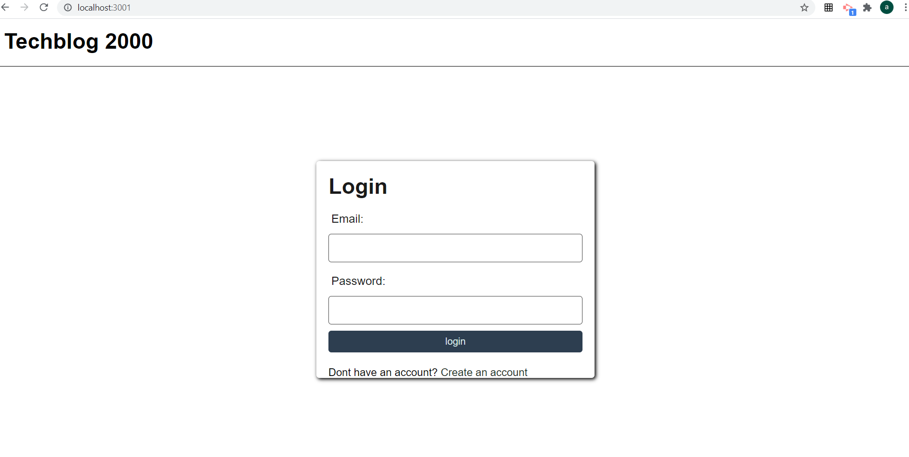
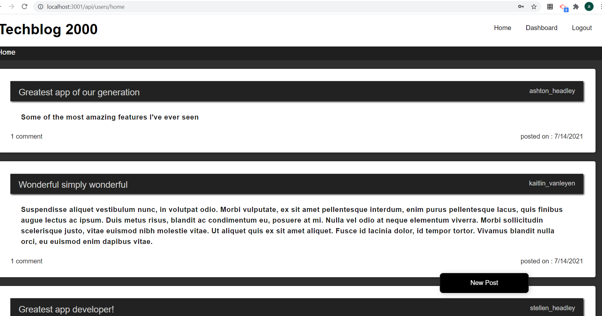
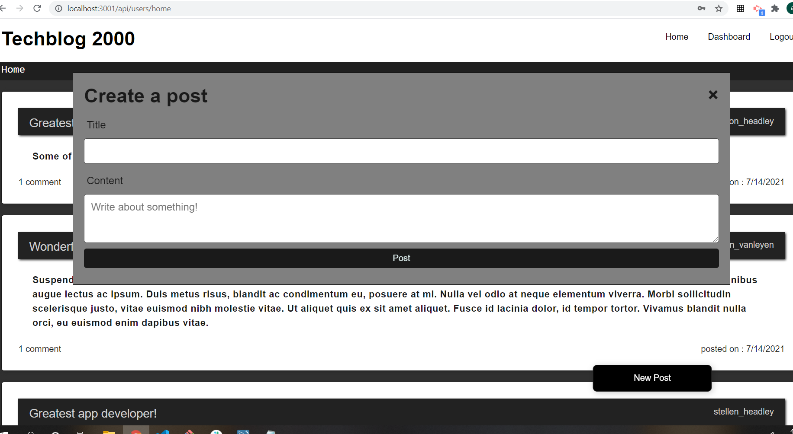

# Techblog 2000
[](https://tech-blog-2000.herokuapp.com/)
[](https://opensource.org/licenses/mit)
  
## Description
a place to post and comment on blogs
  
## Table of Contents
- [Installation](#installation)
- [Usage](#usage)
- [ScreenShots](#screenshots)
- [Links](#links)
- [License](#license)
- [Questions](#questions)
  
## Installation
```md
first run npm i and install dependencies then run npm run start
```
  
## Usage
```md
once you signup you can create edit and delete posts as well as leave comments
```
  
## Screenshots



## Links
https://ashiemotto.github.io/tech-blog-2000/
https://github.com/ashiemotto/tech-blog-2000
https://tech-blog-2000.herokuapp.com/
  
## Reporting
```md
Github
```
## License
[](https://opensource.org/licenses/mit)
  
## Questions a
Add an issue through GitHub:
 https://github.com/Ashiemotto
  
Or using email:
Email: ashheadley@gmail.com

